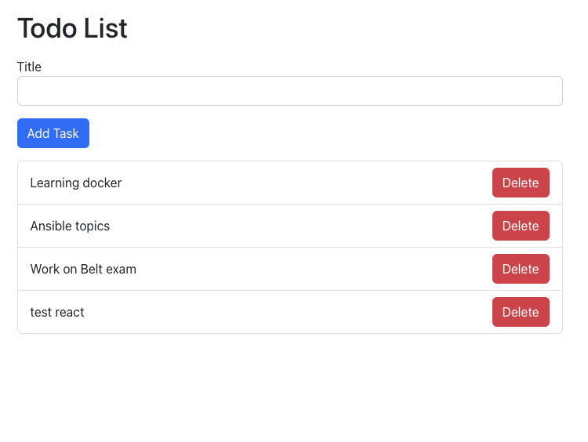

# React Todo App

This is a simple Todo application built with React. The application connects to a backend API built with Flask, which interacts with a MySQL database.




## Features
- View all todo tasks
- Add a new task
- Edit existing task
- Delete a task

## Setup & Installation

To set up this project, follow the steps below:

1. Clone this repository to your local machine:

    ```
    git clone https://github.com/your-username/todo-app.git
    ```

2. Navigate into the project folder:

    ```
    cd todo-app
    ```

3. Install the dependencies:

    ```
    npm install
    ```

4. Start the development server:

    ```
    npm start
    ```

The application should now be running at `http://localhost:3000`.

## Backend code
Backend for this project is based on python flask. Please go to this repo - 
https://github.com/chandradeoarya/todolist-flask

## Project Structure

The project structure is as follows:

```
todo-app/
│
├── node_modules/
├── public/
│   └── index.html
│   └── ...
├── src/
│   ├── components/
│   │   ├── TodoList.js
│   │   ├── TodoItem.js
│   │   ├── AddTodo.js
│   │   └── EditTodo.js
│   ├── App.js
│   ├── index.js
│   └── ...
├── package.json
└── ...
```

## Requirements

- Node.js and npm
- A running instance of the backend Flask API
- A MySQL server

Please adjust the API endpoint in the code if your backend API is not running on `http://localhost:80`.

## Contributions

Contributions are welcome. Feel free to open a Pull Request or a GitHub issue for any corrections, improvements, or new features.

## License

This project is open-source and available under the MIT License. See LICENSE file for more details.